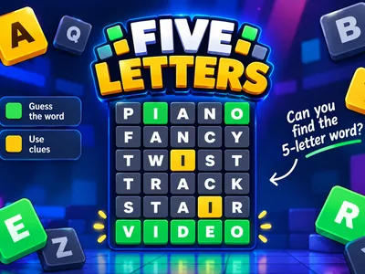
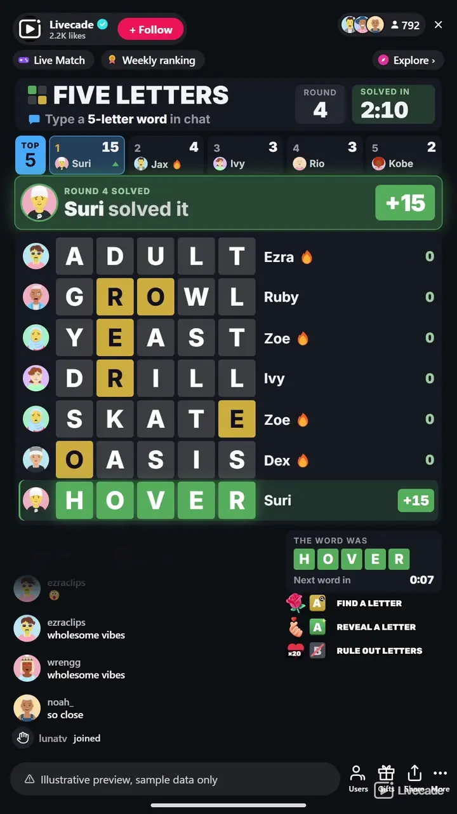

# Five Letters - Interactive TikTok Live Game

> Crack the five-letter word together.

A five-letter word game for your whole chat. Viewers type guesses, every guess lands on the board with its letters colored, and the viewer who types the hidden word wins the round. No timer by default: a word runs until chat cracks it.

**[Play Five Letters on Livecade](https://livecade.io/games/five-letters/?utm_source=github&utm_medium=readme&utm_campaign=five-letters)** - runs as a single browser source in OBS, Streamlabs, or TikTok LIVE Studio. Nothing for viewers to install.

## How viewers play

Viewers take part with the actions TikTok already gives them: **comments**, **gifts**, **likes**. Every action below is rebindable, so you decide which interaction drives which effect.

| Action | What it does |
| --- | --- |
| **Find a Letter** | Shows one letter that is in the word, in gold, without giving away its spot |
| **Reveal a Letter** | Puts one letter in its spot, credited to the viewer. Never the last letters, so chat still has to solve it |
| **Rule Out Letters** | Greys out three letters that are not in the word |

## How it works

### Type a five-letter word

Viewers type a guess in chat. Every real five-letter word lands on the board with the viewer's picture and name, newest at the bottom.

### Green, gold and grey

Each letter colors itself: green in the right spot, gold in the word but elsewhere, grey not in the word. The A to Z strip shows everything chat has found.

### New letters score

Points go only to guesses that find something new, so the whole chat is chasing the next clue rather than repeating known letters.

### Solve it, win it

The first viewer to type the word takes the round and a solve bonus. Play all stream, or end the match after a number of words or at a target score.

## About the game

Five Letters hides one five-letter word and lets your whole chat crack it together. Every guess a viewer types lands on the board with their picture and name, and its letters light up: green for the right letter in the right spot, gold for a letter that is in the word somewhere else, grey for a letter that is not in it at all. An A to Z strip above the board keeps track of every letter chat has found, so a viewer who just arrived can join in with the next guess.

### Built for a busy chat

Only real words count, so chat cannot spam random letters, and a word already on the board is not added twice. Viewers can space out their letters, like h o u s e, to get a word past the chat filter. Points go to whoever finds something new: a letter in its spot, or a letter nobody had found yet, so typing known letters again earns nothing. The viewer who types the word takes a solve bonus and the round.

### No timer, or your own clock

By default a word runs until chat solves it. When nobody finds anything new for a minute, the game reveals a letter on its own, and if chat stays stuck once every hint is used, the word is shown and the next one starts, so a quiet chat never freezes the stream. Prefer a countdown? Switch to timed rounds from one minute to thirty. Over 9,300 secret words across eleven languages, and the word bank is yours to edit.

## What it looks like on stream

[Watch Five Letters gameplay](https://cdn.livecade.io/games/five-letters.mp4)

## What you can configure

- **Language** - Eleven languages for the words, the letters and the on-screen text
- **Your word bank** - Hide secret words you do not want, or add your own five-letter words
- **Round mode** - No timer, or timed rounds from 1 to 30 minutes with a warning in the last seconds
- **Automatic hints** - On or off, and how long chat can go without finding anything new before a letter is revealed
- **Hint limit** - The most letters hints can reveal in one word, so the last ones always have to be guessed
- **Scoring** - Points for a letter in its spot, for a letter in the word, and the solve bonus
- **Guesses per viewer** - Optionally cap how many words each viewer can guess per word
- **Words in capitals** - Optionally count one word typed in capitals inside a longer message
- **Match** - Play all stream, or end after a number of words or at a target score, with a podium for the top three
- **Leaderboard** - Keep the top players on screen, from 3 to 10
- **Read the winner** - Your stream voice reads the word and who solved it
- **Your sounds** - Swap the sounds for a guess, a new letter in place, a hint, the tick, the solve and a missed word
- **Appearance** - Colors for the accent, the cards, the text and all three tile colors
- **Background** - Transparent, a solid color, or your own image
- **Who can play** - Everyone, followers only, or your fans club only. Applies to comments and gifts

## Languages

English, Spanish, Portuguese, French, German, Italian, Indonesian, Turkish, Russian, Romanian, Filipino

## FAQ

<strong>How do viewers play Five Letters?</strong>

They type a five-letter word in your TikTok Live chat. The guess appears on the board with its letters colored green, gold or grey, and the whole chat uses those clues to close in. The first viewer to type the hidden word wins the round.

<strong>Is it like Wordle?</strong>

It is a Wordle-style game rebuilt for a live chat: the whole room guesses together on one scrolling board, every guess shows who typed it, and there are hints, points and a leaderboard. Five Letters is our own game and is not affiliated with Wordle or The New York Times.

<strong>Do viewers need to send gifts to play?</strong>

No. Guessing is free and comment-driven, likes rule out letters, and automatic hints keep a stuck word moving. Gifts can find or reveal a letter, but never the whole word.

<strong>Is there a timer?</strong>

Not by default: a word runs until someone solves it, with hints when chat goes quiet. You can switch to timed rounds of 1 to 30 minutes in the settings.

<strong>Which languages does it support?</strong>

Eleven: English, Spanish, Portuguese, French, German, Italian, Indonesian, Turkish, Russian, Romanian and Filipino. Guesses typed without accents still count.

<strong>Can I choose the secret words?</strong>

Yes. The bank holds over 9,300 secret words across eleven languages, and you can hide any of them or add your own five-letter words. Viewers can guess with around 129,000 real words.

<strong>How do I add Five Letters to my TikTok Live?</strong>

Add one browser source URL to OBS or your streaming software and go live. There is no plugin to install and nothing for your viewers to download.

## Setup

1. [Create a Livecade account](https://app.livecade.io/register?utm_source=github&utm_medium=cta&utm_campaign=five-letters)
2. Copy your overlay browser source URL
3. Paste it into OBS, Streamlabs, or TikTok LIVE Studio
4. Pick Five Letters, set your triggers, and go live

Runs in the browser, so it works on Windows and macOS with nothing to download. [See all TikTok Live games](https://livecade.io/tiktok-live-games/?utm_source=github&utm_medium=readme&utm_campaign=five-letters).

---

_This repository documents Five Letters, a hosted interactive game by [Livecade](https://livecade.io/?utm_source=github&utm_medium=footer&utm_campaign=five-letters). The game runs on Livecade's platform, so there is no source to install here._
